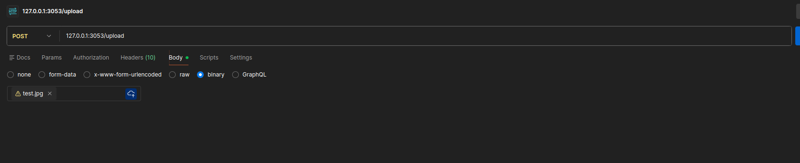

## File system manager
This project is an advanced file system manager built with Node.js, featuring HTTP and WebSocket servers for handling file operations.

### 1. File Structure & Module Responsibilities

*   `download/`: Default directory for files available for download.
*   `upload/`: Default directory for uploaded, renamed, compressed, and encrypted files.
*   `source/index.js`: The main entry point. It initializes and starts the HTTP server, attaches the router, and sets up the WebSocket server.
*   `source/config.js`: Stores configuration variables like port numbers and directory paths.
*   `source/router.js`: Routes incoming HTTP requests to the appropriate handler based on the URL and HTTP method.
*   `source/webSocket.js`: Manages the WebSocket server, handling real-time communication with clients.
*   `source/handlers/`: This directory contains the logic for handling specific API endpoints.
    *   `uploadHandler.js`: Manages file uploads via POST requests to `/upload`.
    *   `downloadHandler.js`: Manages file downloads via GET requests to `/download`.
    *   `deleteHandler.js`: Handles file deletion via DELETE requests to `/upload`.
    *   `handleRename.js`: Handles file renaming via PUT requests to `/upload`.
    *   `handleGzip.js`: Manages file compression (archiving) via GET requests to `/upload/compress`.
    *   `handleEncryption.js`: Manages file encryption via GET requests to `/upload/encrypt`.
*   `source/util/`: Contains helper modules.
    *   `error.js`: A utility for sending standardized error responses to the client.
    *   `filesystem.js`: Provides filesystem-related helper functions, such as ensuring a directory exists.

#### Flow of Operation

1.  **Upload**: A `POST` request to `/upload` is routed to `uploadHandler.js`. The request body, which is a stream, is piped to a file write stream, saving the file in the `upload/` directory.
2.  **Download**: A `GET` request to `/download/:filename` is routed to `downloadHandler.js`. It creates a read stream for the requested file and pipes it to the HTTP response stream.
3.  **Delete**: A `DELETE` request to `/upload/:filename` is routed to `deleteHandler.js`, which removes the specified file from the `upload/` directory.
4.  **Rename**: A `PUT` request to `/upload/:filename` with a new name is routed to `handleRename.js`, which renames the specified file.
5.  **Archive (Compress)**: A `GET` request to `/upload/compress/:filename` is routed to `handleGzip.js`. It reads the file, compresses it using a Gzip stream, and saves the new `.gz` file.
6.  **Encrypt**: A `GET` request to `/upload/encrypt/:filename` is routed to `handleEncryption.js`. It reads the file, encrypts it using a crypto cipher stream, and saves the new `.enc` file.

### 2. Stream-Based Architecture

#### Why is streaming necessary?

Streaming is essential for handling large files and network data efficiently. Instead of loading an entire file into memory before processing (which can exhaust RAM and crash the application for large files), streams allow you to process data in small, manageable chunks. This leads to lower memory usage, better performance, and improved scalability.

#### `fs.readFile` vs. `fs.createReadStream`

*   **`fs.readFile`**: This function reads the entire contents of a file into a buffer in memory before making it available. This is simple for small files but is highly inefficient and risky for large files, as it can consume a large amount of memory.
*   **`fs.createReadStream`**: This function creates a readable stream for a file. Data is read from the file and emitted in chunks as they become available. This allows you to start processing the data almost immediately without waiting for the whole file to be loaded, resulting in significantly lower memory overhead.

#### Backpressure

Backpressure is a fundamental concept in stream processing. It is a mechanism that handles situations where a readable stream (like a file read stream) is producing data faster than a writable stream (like an HTTP response or a file write stream) can consume it.

Without backpressure, the fast-producing stream would overwhelm the slow-consuming stream, causing data to be buffered in memory indefinitely, which could lead to the same memory exhaustion problems that streams are meant to solve. The stream's internal buffering mechanism automatically pauses the readable stream when the buffer is full and resumes it once the writable stream has caught up, ensuring a smooth and memory-efficient data flow.

### 3. Upload Use case

- Uploading the file

- Broadcasted response

